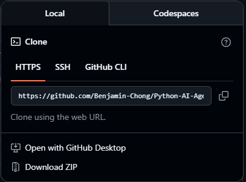
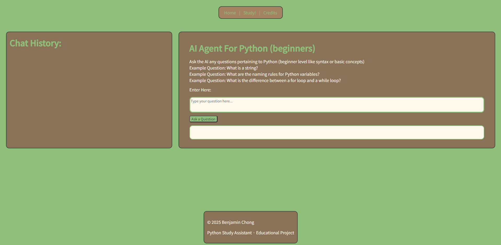
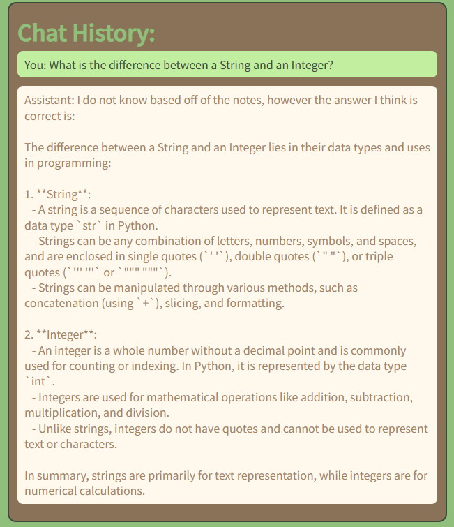

# Python AI Agent

## Overview
- A beginner focused Python study asssistnat that answers questions strictly using my own handwritten Markdown notes (credit to 30 Days of Python).
- Github Link: https://github.com/Asabeneh/30-Days-Of-Python
- The goal is to help beginners deepen their understanding of fundamental concepts.
- Answers are grounded in my own notes that have been checked through.
This project is intentionally scoped to an intro-level Python course and prioritizes correctness, transparency, and system design over a larger scope.

## Motivation
- Currently, many AI tools suffer from hallucination, provide answers without giving their source.
- Guess answers, as opposed to letting the user know that they do not know.
This project explores how retrieval-based grounding (RAG) can help alleviate some of these issues.

# High Level architecture
The project achitecture is a layered architecture and goes as follows: Frontend -> Backend -> Retrieval + Prompting -> Response
- Frontend only handles the UI and UX
- Backend calls ONLY calls the AI Agent method
- Frontend NEVER calls any part of the AI agent

# Backend Design
Request Flow
1. User submits a question from the frontend
2. Backend receives a request via FastAPI /ask endpoint
3. The relevant notes are retrieved
4. Two-part prompting strategy is applied.
5. Answer is returned to the frontend

## Two-part Prompting
1. The first step is to answer the question using ONLY then retrieved notes (strict prompting).
2. The second step is to refine the answer using the notes, the first draft, and the second prompt (flexible).
This separation helps reduce hallucinations while maintaining readability.

## Failure Handling
- My system is designed to fail gracefully and is extremely transparent.
Example:
1. If there are notes retrieved are not similar to the question, the assistant informs the user that the topic is not covered.
2. If there is no response from Part 1, the second part will not run.
3. Out of scope questions are answered transparently rather than guessed.
My priority was trust and transparency, while balancing a somewhat complete answer.

# Frontend Overview
## Pages
1. Home Page: details the scope and the purpose of this project. It briefly explains to the user how to use the assistant.
2. Study Page: keeps a record of the messages between the user and the assistant and has a space for the user to ask questions.
3. Credits Page: credits the author of the 30 days of Python, explains the stack used, gives credit to OpenAI.

## UI & Styling
- CSS Flexbox layout
- Calm matcha themed cafe color pallete
- Noto Sans JP font
- Rounded components and reduced visual noise

## Chat Interface Features
- Scrollable chat history
- Messages appended to the chat history
- Distinct colors for user and assistant messages
- Auto growing textarea
- Custom Scrollbar styling

# Tech Stack
- Frontend: HTML, CSS, JavaScript
- Backend: Python, FastAPI, ChromaDB (to store embeddings)
- AI approach: RAG, multi-phase prompting
- Notes: used .md files to improve AI performance (md files are lightweight and conveys meaning better)

# Project Scope & Limitations
- Focused on beginner level questions.
- Answers are transparent when answers do not come from notes.
- No authentication or user persistence
- Not intended to replace courses

# Future Improvements
- Expand note coverage
- Increase quality of existing notes
- Add automated tests
- Refine documentation

## Why This Project
This was an exploration project to explore a full stack application paired with AI features.

### Getting Started
1. Clone this repo.

*Click on <> Code First*

2. Download all of the required packages from requirements.txt
3. Open your desired IDE.
4. Start the frontend and backend servers using the following commands:
- Run: uvicorn backend.main:app --reload (backend)
- Run: python -m http.server 5500
- Open: http://localhost:5500/frontend/homepage.html (frontend)
5. Navigate to the study page using the green button labeled: 'Start Studying' or use the navigation bar at the top.

6. Enter any beginner Python related question (Note: give 5-10 seconds for the response):

*The answer will show up in the bottom box*
7. The question and answer pair will be appended to the chat history on the left.

### Tests
(Continued)

### Notes on System Limitations
- This project does not cross-reference information across separate note chunks.
  For example, a question like *“What is the difference between a string and an integer?”* may be declined if those concepts are defined in separate notes.
- To improve trust and reduce hallucinations, the assistant only answers questions when all required information is present within the retrieved context.
- Some comparison questions work when the relevant concepts are documented together.
  For example, *“What is the difference between a for loop and a while loop?”* is answerable because both concepts are covered within the same note.

